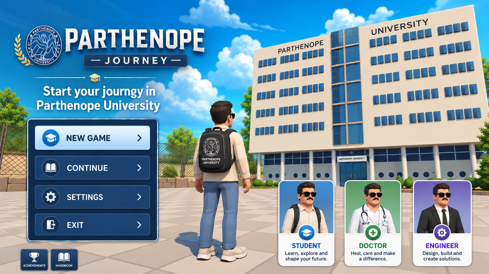
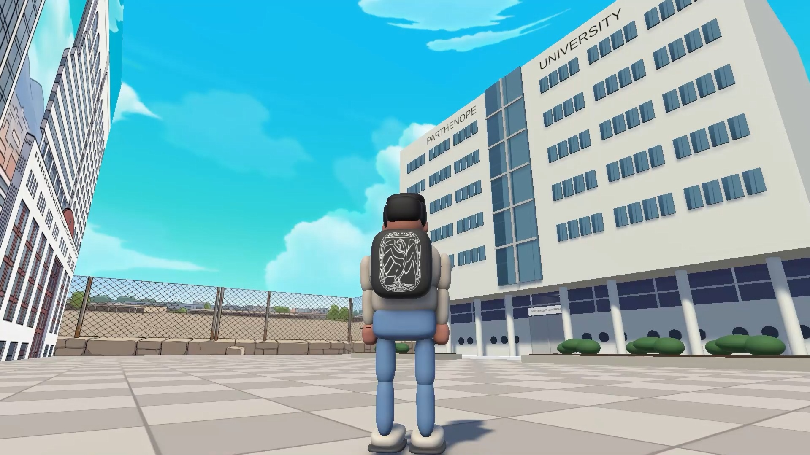
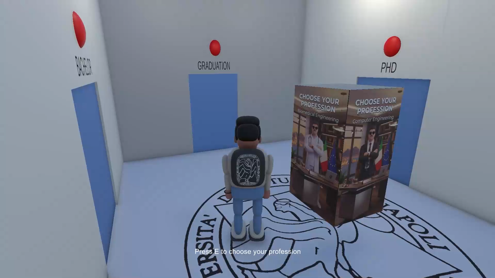
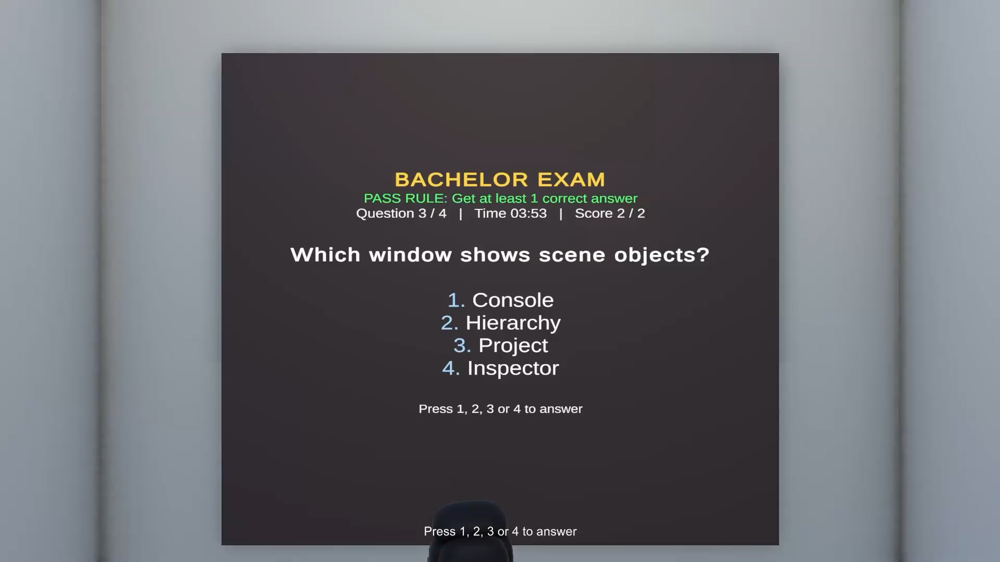

# 🎓 Parthenope Journey

<p align="center">
  
</p>

<p align="center">
  <strong>A 3D Academic Journey Game Developed with Unity and C#</strong>
</p>

<p align="center">
  🎮 Unity &nbsp;•&nbsp; 💻 C# &nbsp;•&nbsp; 🏫 Academic Project &nbsp;•&nbsp; ⚙️ Procedural Animation
</p>

---

## 📌 Project Information

**Developer:** Milad Mohammadi  
**Academic Supervisor:** Prof. Maurizio De Nino  
**University:** University of Naples Parthenope  
**Engine:** Unity 6  
**Programming Language:** C#  

---

## 🎮 Overview

**Parthenope Journey** is a 3D third-person academic game developed in Unity.

The project transforms a university environment into an interactive academic journey. The player enters the university, explores the environment, selects a professional path, completes academic stages and quizzes, and progresses toward graduation.

The project combines **gameplay programming, interactive environments, physics, academic progression systems, quiz mechanics, procedural character generation, and procedural animation**.

---

## 🕹️ Gameplay Flow

The main gameplay progression follows this sequence:

**Start Game → Explore University → Enter Reception → Select Profession → Complete Academic Stages → Pass Quizzes → Unlock New Areas → Reach Final Room → Graduation**

The player can select different professional paths, including **Doctor** and **Engineer**, which influence parts of the academic experience and quiz content.

---

## 📸 Gameplay Preview

### University Environment

The player explores a 3D university environment using a third-person character controller.

<p align="center">
  
</p>

### Academic Progression

Different areas of the university represent stages of the academic journey. Progress is controlled by the game logic and completed stages.

<p align="center">
  
</p>

### Interactive Quiz System

Academic stages include interactive quizzes with multiple-choice questions, scoring, a timer, and progression requirements.

<p align="center">
  
</p>

---

## 🧩 Software Architecture

The project is organized into multiple C# components responsible for independent gameplay systems.

```text
MainMenuController
├── PlayerMovement
└── SimpleCameraFollow

PlayerMovement
├── PlayerFootstepAudio
├── PlayerPushObjects
└── MiladProceduralAnimator

ReceptionInteraction
├── CharacterSwitcher
├── PlayerMovement
└── GameProgressManager

GameProgressManager
├── StageSlidingDoor
├── StageQuizRoom
└── FinalRoomController

StageQuizRoom
├── GameProgressManager
├── PlayerMovement
├── Main Camera
├── Quiz Camera
└── TextMeshPro

DoubleEntranceDoor
└── SlidingDoorAudio

StageSlidingDoor
└── SlidingDoorAudio

FinalRoomController
├── PlayerMovement
├── VideoPlayer
└── SceneManager
```

This modular structure separates player control, interaction, progression, quizzes, doors, audio, animation, and final-stage logic.

---

## ⚙️ Core Systems

### Player Control System

The player is controlled through a third-person movement system implemented in C# using Unity's `CharacterController`.

The system manages:

- Player movement
- Gravity
- Character rotation
- Camera-relative navigation
- Collision handling

The camera follows the player through a dedicated `SimpleCameraFollow` component.

---

### Interaction System

The environment contains multiple interactive elements implemented through Unity collision and trigger systems.

Interactions include:

- Reception interaction
- Profession selection
- Academic stage activation
- Door triggers
- Quiz activation
- Final room interaction

The project uses **Trigger Colliders** for several gameplay interactions.

---

### Game Progress System

`GameProgressManager` manages the player's progression through the academic journey.

It tracks:

- Selected profession
- Completed academic stages
- Door availability
- Quiz progression
- Access to the final stage

New areas become accessible as the player successfully completes the required stages.

---

## 🧠 Quiz System

The quiz system is managed primarily through `StageQuizRoom`.

Each quiz can contain:

- Multiple-choice questions
- Profession-based question sets
- Countdown timer
- Score tracking
- Correct/incorrect answer evaluation
- Stage completion logic

The quiz system communicates with `GameProgressManager` to update the player's academic progress.

---

## 🚪 Door & Environment Interaction

Doors are controlled using dedicated C# components such as:

- `DoubleEntranceDoor`
- `StageSlidingDoor`
- `SlidingDoorAudio`

Doors can react to player interaction and progression conditions.

Audio feedback is also connected to door movement to improve environmental interaction.

---

## ⚛️ Physics & Collision

Unity's physics and collision systems are used to make the environment more interactive.

The `PlayerPushObjects` component uses `OnControllerColliderHit` to detect collisions between the player and movable objects.

Objects with a `Rigidbody` can receive force from the player.

This allows the player to physically interact with objects such as tables and chairs in the environment.

---

## 🤖 Procedural Character Generation

The project includes a procedural character system.

`MiladStudentGenerator` is responsible for generating character components and assembling the student character used in the game.

This approach provides greater control over character construction directly inside the Unity project.

---

## 🚶 Procedural Character Animation

Instead of relying only on traditional pre-made animation clips, the project implements a custom procedural animation system in C#.

`MiladProceduralAnimator` detects whether the character is moving and procedurally controls body joints.

Arm and leg movement is generated using mathematical functions such as:

```csharp
Mathf.Sin()
```

and rotations are applied using Unity's quaternion system.

The general process is:

```text
Detect Player Movement
        ↓
Calculate Animation Cycle
        ↓
Rotate Arms and Legs
        ↓
Generate Walking Motion
        ↓
Return to Idle When Movement Stops
```

This demonstrates how character movement can be generated programmatically without depending entirely on external animation clips.

---

## 🧍 Character Selection

The project includes different character representations associated with professional paths.

The character selection system is managed through components including:

- `CharacterSwitcher`
- `ReceptionInteraction`
- `GameProgressManager`

The selected profession influences the player's progression and related gameplay content.

---

## 💡 Lighting & Visual Environment

The university environment uses multiple Unity lighting and visual systems.

These include:

- Directional Light for outdoor sunlight
- Point Lights for indoor environments
- Realtime lighting
- Realtime shadows
- Materials and textures
- Skybox environment
- Environmental props

Reusable architectural elements are organized using Unity **Prefabs**.

---

## 🔊 Audio & Multimedia

The project includes audio feedback and multimedia elements to improve immersion.

Audio systems include:

- Player footsteps
- Door sounds
- Outdoor ambient audio
- Environmental audio

The final stage also integrates Unity's `VideoPlayer` system for multimedia presentation.

---

## 🧱 Prefab-Based Environment Design

Repeated architectural components are organized as reusable Unity Prefabs.

Examples include:

- Windows
- Columns
- Structural elements
- Environmental components

This approach reduces duplication and makes the scene easier to maintain and modify.

---

## 📜 Main C# Scripts

Some of the main scripts developed for the project include:

```text
PlayerMovement.cs
SimpleCameraFollow.cs
PlayerPushObjects.cs
PlayerFootstepAudio.cs

CharacterSwitcher.cs
ReceptionInteraction.cs
GameProgressManager.cs
StageQuizRoom.cs

DoubleEntranceDoor.cs
StageSlidingDoor.cs
SlidingDoorAudio.cs

MainMenuController.cs
OutdoorAmbientZone.cs
FloatingStand.cs
FinalRoomController.cs

MiladProceduralAnimator.cs
MiladStudentGenerator.cs
```

---

## 🛠️ Technologies

| Technology | Application |
|---|---|
| Unity | Game engine and 3D environment |
| C# | Gameplay and system programming |
| CharacterController | Third-person player movement |
| Rigidbody | Physics-based object interaction |
| Collider / Trigger Collider | Collision and interaction detection |
| TextMeshPro | Quiz and UI text |
| VideoPlayer | Final multimedia content |
| Prefabs | Reusable environment components |
| Unity Lighting | Indoor and outdoor illumination |

---

## 📂 Project Structure

```text
Parthenope-Journey-Unity-Game/
│
├── Assets/
│   └── Game assets, scenes, scripts and resources
│
├── Packages/
│   └── Unity package configuration
│
├── ProjectSettings/
│   └── Unity project settings
│
├── docs/
│   └── images/
│       ├── Parthenope-University-Journey.png
│       ├── Parthenope-University-Journey2.png
│       ├── Parthenope-University-Journey3.png
│       └── Parthenope-University-Journey4.png
│
├── .gitignore
├── LICENSE
└── README.md
```

---

## ▶️ How to Run

1. Clone or download this repository.
2. Open **Unity Hub**.
3. Select **Add project from disk**.
4. Select the project folder.
5. Open the project using the compatible Unity version.
6. Open the main game scene.
7. Press **Play** in the Unity Editor.

> Unity may need some time to import and rebuild the project files when the project is opened for the first time.

---

## 🎯 Project Objectives

The main objectives of this project were to explore:

- Object-oriented programming in C#
- Unity gameplay architecture
- Third-person player control
- Interactive 3D environments
- Physics and collision systems
- State and progression management
- Quiz-based gameplay
- Procedural character generation
- Procedural animation
- Audio and multimedia integration

---

## 🚀 Future Development

Possible future improvements include:

- Additional academic stages
- More professional paths
- Expanded quiz databases
- Improved character customization
- More advanced procedural animations
- Save/load system
- Achievement system
- Improved UI/UX
- Additional environmental interactions
- Expanded university environments

---

## 🎓 Academic Context

**Parthenope Journey** was developed as an academic project at the **University of Naples Parthenope**.

**Developer:** Milad Mohammadi  
**Academic Supervisor:** Prof. Maurizio De Nino

The project demonstrates the design and implementation of an interactive 3D application using Unity and C#, with particular attention to modular gameplay systems, interaction logic, academic progression, physics, and procedural character animation.

---

## 👨‍💻 Developer

**Milad Mohammadi**

Unity / C# Academic Project  
University of Naples Parthenope

---

## 📄 License

This repository is provided under the license included in the `LICENSE` file.

© 2026 Milad Mohammadi
